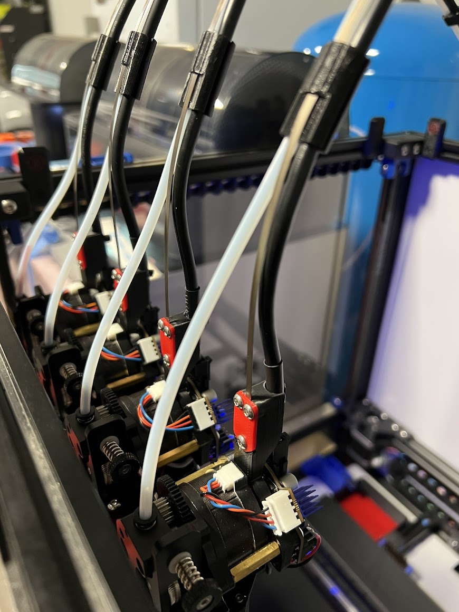

## EBB36 (and similar) Umbilical Mount

This is made to hold the spring steel for the umbilicals which can be found here: 
https://github.com/DraftShift/CableManagement

#### Caution: The space between the toolhead and your first umbilical support point will need to be longer or the spring steel will twist at the front corners of the bed. 

### Installation: 
- Use a pair of pliers to insert the spring steel perpendicular to the mount, it should embed about 5mm into the part. 
- Bend the steel to the top.  Use the pliers or something hard to press down on the spring steel near the point of insertion to crease the bed more.
- Hold the plate in place and loosly attach the top 2 screws. 
- Install the bottom screw and tighten all screws.

### BOM: 

|Item|Quantity|
|-|:-:|
|M3x6 BHSC | 3 |
|M3 Threaded Insert | 3 |

 

